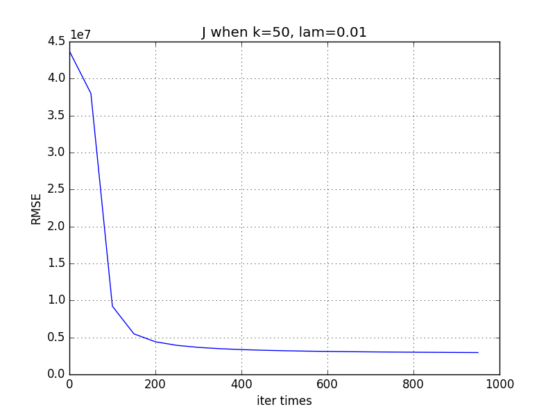
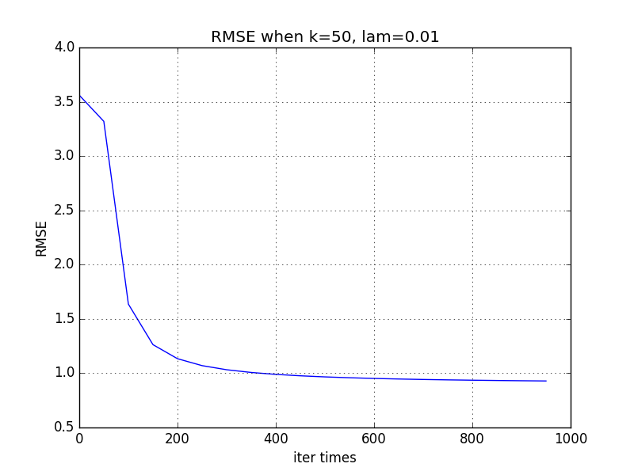

# 个性化推荐

##### 1. 数据预处理

* **数据整理简单说明**

由于用户 id 和用户*电影评分的矩阵行号无法直接对应，故通过通过user.txt文件形成用户 id-矩阵行号 的映射 Map，将用户 id 和矩阵行号对应起来。电影 id 可以和电影的列号进行对应。

初始化X_train和 X_test 为$10000*10000$的矩阵，初始值为$0$。逐行读入文件 netflix_train.txt与 netflix_test.txt，分别写入X_train和 X_test。

* **是否采用全量数据**

采用全量数据，数据预处理的时间开销为：14.832932472229004秒

##### 2. 基于用户的协同过滤

* **代码简单介绍**

第一步：采用余弦相似度计算用户间的相似性矩阵
$$
sim(X(i),X(k)) =cos(X(i),X(k)) = \frac{X(i)\cdot X(k)}{|X(i)|\cdot |X(k)|}
$$
其中$sim(X(i),X(k))$代表用户$i$和用户$k$的相似度。

关键代码如下：

```python
# 计算余弦相似度
# sim_users[i][j]存储了用户i和用户j之间的相似度
norm = np.matrix(np.linalg.norm(X_train, axis=1))
sim_users = np.dot(X_train, X_train.T) / np.dot(norm.T, norm)
```

用户相似性矩阵的时间开销为：7.1689605712890625秒

第二步：基于用户的协同过滤算法
$$
score(i,j) = \frac{\sum_{k}sim(X(i),X(k))\cdot score(k,j)}{\sum_{k}sim(X(i),X(k))}
$$
用户$i$对于电影$j$的打分预测，是基于所有对于 电影$j$有过打分行为用户$k$进行的。

关键代码如下：

```python
# 计算用户对电影打分的估计
score = np.dot(sim_users, X_train)/np.dot(sim_users, X_train>0)
```

基于用户的协同过滤算法时间开销为：20.259201288223267秒

* **最终的 RMSE**

  ```python
  # 计算 RMSE
  N = np.sum(X_test>0)
  RMSE = np.sqrt(np.sum(np.square(score * (X_test > 0) - X_test)) / N)
  ```

  RMSE:  1.01836903941

* **算法的时间开销**

  用户相似性矩阵的时间开销为：7.1689605712890625秒

  基于用户的协同过滤算法时间开销为：20.259201288223267秒

  由此总共的时间开销为：27.42816185951233秒

##### 3. 矩阵分解算法

矩阵分解算法意在通过矩阵分解，通过梯度下降算法迭代逼近原始矩阵有评分的部分，而将矩阵中其他部分作为用户对电影评分的预测值。矩阵分解算法需要指定：隐空间维度$k$，正则项控制参数$\lambda$，梯度下降学习率$\alpha$，迭代次数$step$。

值得注意的是，梯度下降学习率$\alpha$的选择与算法收敛息息相关。最开始$\alpha$选取0.01是，算法无法收敛。这是因为$\alpha$的选择和矩阵规模相关，对于10000*10000的矩阵，在选取$\alpha=0.00001$后，梯度下降算法收敛。下述实验结果在$\alpha=0.00001$下完成。

* $k=50, \lambda=0.01$

  迭代1000次后，最终的RMSE=0.926992

目标函数 J的变化：



测试集上 RMSE 的变化:



结果分析：

随机初始化时，RMSE=3.560846，随着迭代次数的增加，RMSE 持续降低。迭代325次后RMSE1.018323即达到和协同过滤算法类似效果。迭代1000次后，最终的RMSE=0.926992。此外随迭代次数的增加，RMSE 下降速率变缓。目标函数 J 有类似规律。

* 调整$k$值和$\lambda$值

  最优的参数组合

##### 4. 两种方法的优缺点比较

从实验结果来看，通过合理选取$k$值和$\lambda$值，矩阵分解算法的结果优于协同过滤算法。协同滤波的算法复杂度为$O(n^3)$，而矩阵分解算法复杂度为$O(step*k*n^2)$。从实验可知，当k取一个较小的值时即可取得相较协同滤波更好的性能。但是当step选取较高时，两者复杂度可能相差不大。 

矩阵分解算法对于初始参数的设定依赖性很强，可知当$k=50，λ=0.01$时，即使迭代1000次其结果仍然不如迭代100次的k=20或k=10。虽然算法复杂度较低，但是需要通过不断尝试调整参数获得更优解。而协同滤波算法则不受参数设置的约束，其所有选取的信息均为已知。 

